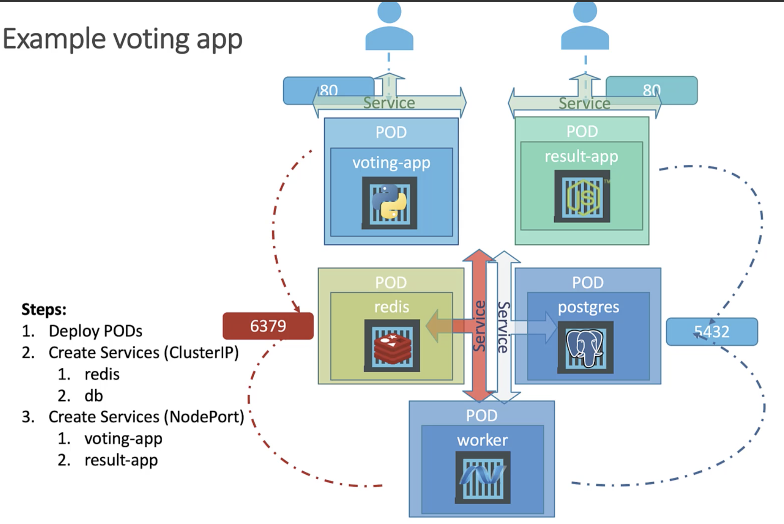

# Voting app 

Sample distributed app with 5 components

## Architecture:

## Commands:

### manually without deployments
Deploy all pods and services:

    kubectl create -f postgres-pod.yaml
    kubectl create -f postgres-service.yaml
    kubectl create -f redis-pod.yaml
    kubectl create -f redis-service.yaml
    kubectl create -f result-app-pod.yaml
    kubectl create -f result-app-service.yaml
    kubectl create -f voting-app-pod.yaml
    kubectl create -f voting-app-service.yaml
    kubectl create -f worker-app-pod.yaml

### with deployments
Create all deployments and services with kubectl

    kubectl create -f voting-app-deployment.yaml
    kubectl create -f voting-app-service.yaml
    kubectl create -f postgres-deployment.yaml
    kubectl create -f postgres-service.yaml
    kubectl create -f redis-deployment.yaml
    kubectl create -f redis-service.yaml
    kubectl create -f result-app-deployment.yaml
    kubectl create -f result-app-service.yaml

Then inspect the creation of all components:

    kubectl get pods,svc

you should see something like:

    NAME                 READY   STATUS              RESTARTS   AGE
    pod/postgres-pod     1/1     Running             0          24m
    pod/redis-pod        1/1     Running             0          24m
    pod/result-app-pod   0/1     ContainerCreating   0          17m
    pod/voting-app-pod   1/1     Running             0          28m
    pod/worker-app-pod   1/1     Running             0          21m
    
    NAME                     TYPE        CLUSTER-IP       EXTERNAL-IP   PORT(S)        AGE
    service/db               ClusterIP   10.105.185.6     <none>        5432/TCP       24m
    service/kubernetes       ClusterIP   10.96.0.1        <none>        443/TCP        16d
    service/redis            ClusterIP   10.106.9.148     <none>        6379/TCP       24m
    service/result-service   NodePort    10.107.190.253   <none>        80:30005/TCP   17m
    service/voting-service   NodePort    10.97.41.195     <none>        80:30004/TCP   28m

Then get the urls of the two web apps:

voting app:
    minikube service voting-service --url
    http://192.168.99.100:30004

results app:
    voting-app:$ minikube service result-service --url
    http://192.168.99.100:30005

## Scaling the app

If you have used deployments to create the apps you can scale it like this:

    voting-app:$ kubectl scale deployment voting-app-deploy --replicas=3
    deployment.extensions/voting-app-deploy scaled